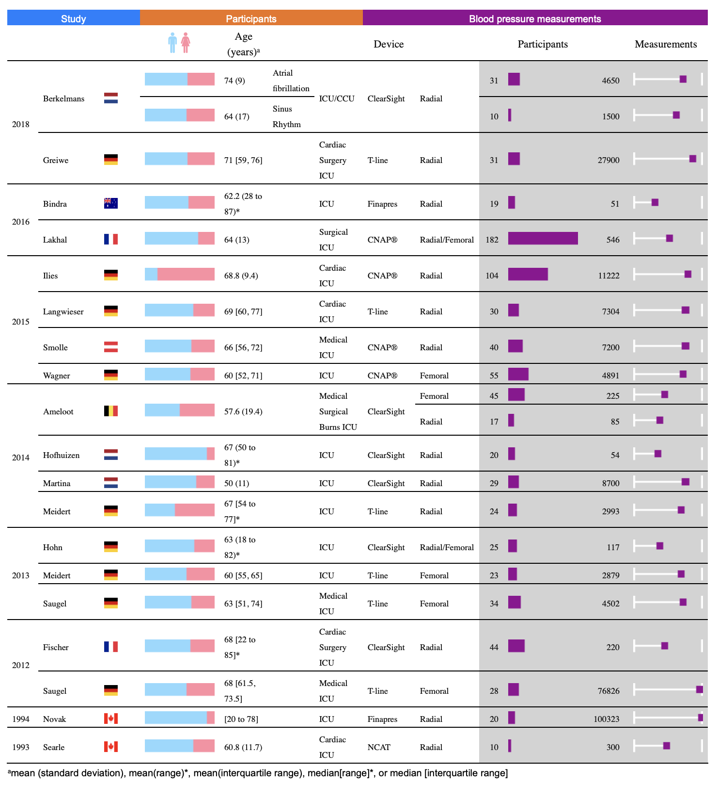

# ESMARConf presentation

This repo contains a code for a presentation on using the {flextable}
package to create a ‘graphical’ study characteristics table for
systematic reviews.

Systematic reviews are a type of academic publication, which involves
the identification, critical appraisal and synthesis of results from
multiple studies. It is very common in these types of publications for a
‘summary’ of the characteristics of each study included in the
systematic review to be presented in the form of a table consisting
entirely of text. This presentation demonstrates how the
[flextable](https://davidgohel.github.io/flextable/articles/overview.html)
package was used to replace some of the text with graphical features for
a study characteristics table. The printing of the table in landscape
format in the knitted word document was achieved using the
[officedown](https://davidgohel.github.io/officedown/) package. This
table format is highly customisable. An example of a published
static-print table using this same format, which we created for an
earlier publication, is available [here](https://rdcu.be/b4AoO). Some
features of the table include:

-   Use of a coloured inline ‘minibar’ images to show the male:female
    ratio in included studies
-   Images of flags (using
    [flagon](https://coolbutuseless.github.io/2020/04/03/introducing-flagon-a-package-of-just-flag-images-in-png-and-svg-format/))
    to indicate the country (in addition to being aesthetically more
    pleasing than presenting this information in text, this feature also
    reduced the amount of horizontal space required for this column,
    which is useful for static-print tables that need to be incorporated
    into Word documents).
-   Use of inline ‘minibar’ images so the reader can more quickly and
    clearly distinguish between studies that included higher numbers of
    participants than if the information was presented in text format.

